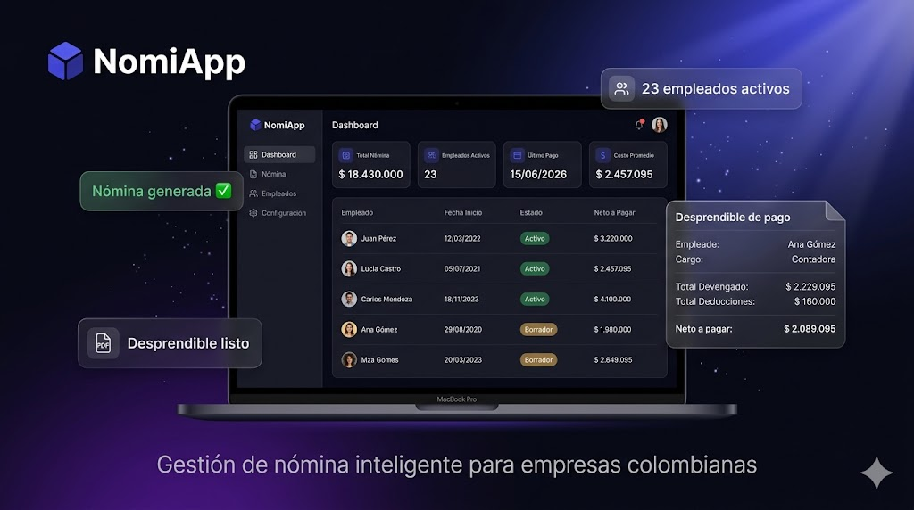

<div align="center">



# NomiApp

> Plataforma SaaS de gestión de nómina y contabilidad laboral para empresas colombianas.

NomiApp permite a contadores y administradores gestionar empleados, contratos y nóminas de múltiples empresas desde un solo lugar, con cálculos automáticos según la legislación colombiana vigente (SMMLV 2026) y generación de desprendibles de pago en PDF.

</div>

---

## ✨ Features

- 🏢 **Multi-empresa** — gestiona múltiples empresas desde un panel central
- 👥 **Gestión de empleados** — contratos término fijo, indefinido y obra labor
- 🧮 **Cálculo automático de nómina** — salud, pensión, auxilio de transporte según ley colombiana
- 📄 **Generación de PDFs** — nómina completa y desprendibles individuales por empleado
- 🔐 **Roles de acceso** — Super Admin y Admin por empresa
- 📊 **Dashboard por empresa** — resumen de empleados activos y costos laborales

---

## 🛠 Stack

### Frontend

| Tecnología | Descripción |
|---|---|
|  | Librería UI principal |
|  | Tipado estático |
|  | Bundler y dev server |
|  | Estilos utilitarios |
|  | Componentes accesibles (Radix UI) |
|  | Fetching y caché de datos |
|  | Estado global |
|  | Manejo de formularios |
|  | Validación de esquemas |
|  | Cliente HTTP con interceptores JWT |

### Backend

| Tecnología | Descripción |
|---|---|
|  | Lenguaje principal |
|  | Framework API REST async |
|  | Base de datos relacional |
|  | ORM async |
|  | Migraciones de base de datos |
|  | Autenticación stateless |
|  | Generación de PDFs |
|  | Contenedores (PostgreSQL + pgAdmin) |

---

## 🚀 Getting Started

### Prerrequisitos

- Node.js 18+
- Backend NomiApp corriendo en `http://localhost:8000`

### Instalación

```bash
git clone https://github.com/MiloZ-Dev/nomiapp.git
cd nomiapp
npm install
```

### Variables de entorno

```bash
cp .env.example .env
```

Edita `.env`:

```env
VITE_API_URL=http://localhost:8000/api/v1
```

### Desarrollo

```bash
npm run dev
```

Abre [http://localhost:5173](http://localhost:5173)

### Build

```bash
npm run build
```

---

## 📁 Estructura

```
src/
├── api/          # Clientes HTTP por módulo
├── components/   # Componentes UI reutilizables
├── context/      # AuthProvider y contexto global
├── hooks/        # Custom hooks
├── pages/        # Vistas por ruta
│   └── empresa/  # Dashboard, Empleados, Nómina
├── routes/       # Configuración de rutas y guards
├── store/        # Estado global (Zustand)
└── types/        # Tipos TypeScript
```

---

## 📸 Screenshots

*Próximamente — en desarrollo activo.*

---

## 👨‍💻 Autor

Desarrollado por [@MiloZ-Dev](https://github.com/MiloZ-Dev)

---

## 📝 Licencia

Propietario — todos los derechos reservados © 2026 NomiApp